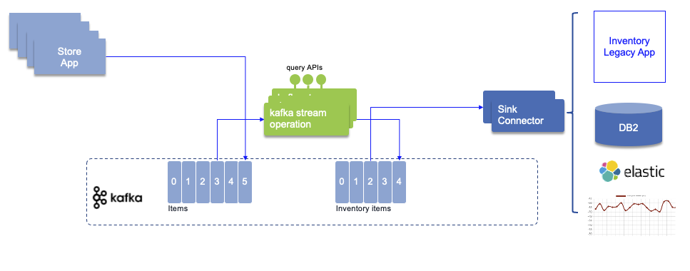

# Real time inventory with kafka labs

This scenario implements a simple real time inventory management solution based on real life MVPs we developed in 2020. 
Stores are sending their sale transactions to a central messaging platform, based on queues or topics, and with the adoption of loosely coupled microservices, 
real time analytics Kafka is part of the architecture. Adopting Kafka Connect helps to integrate with existing applications 
without any changes to their base code.



This scenario addresses multiple use cases that aim to build an end to end data pipeline solution from source to different potential sinks:

* The store simulator inject directly sell events to Kafka to the `items` topic
* The store simulator can also generate message to IBM MQ using JMS API or to RabbitMQ using AMQP protocol
* When messages are sourced to Queues, then a Kafka Source Connector is used to propagate message to `items` topics.
* The Item-aggregator computation is done using Kafka Stream component which produces inventory items and keeps, in-memory, a item stock cross stores. 
* The Store-aggregator is also a Kafka Stream implemenetation to produces store inventory. 

These inventories are exposed by API and are using the Kafka Streams interactive query capability.

* Different sink connectors can be plugged into the `item-inventory` or `store-inventory` topics to move data to DB2, Elastic Search, Cloud Object Storage...

## Pre-requisites

This project has only gitops files and scripts to run the solution locally or to deploy on OpenShift. The images of each service used are in the `quay.io` image registry.

## Lab 1: Kafka only solution to demonstrate real-time inventory

For detail about this application see [the article](https://ibm-cloud-architecture.github.io/refarch-eda/scenarios/realtime-inventory/) in EDA reference architecture.

To run locally with docker compose, be sure to have allocated enought docker resource: `4 CPUs, 9 GB RAM, Swap: 1 GB`

`docker-compose -f environment/local/docker-compose up -d`

## Lab 2: Deploy to an OpenShift Cluster

### Deploy environment

#### Tekton Pipeline

We will start by deploying Tekton and custom pipeline. First verify the environment setting in the `./scripts/env-amq-streams.sh` file.

We can use a unique script to create a project with `-pipe` suffix, deploy Tekton operator if not yet set, and a builder service account, all this with the following command.

```sh
./scripts/deployPipelineEnv.sh
```

#### Nexus repository

```sh
/scripts/deployNexus.sh
```

Get external URL to access Nexus: ``


